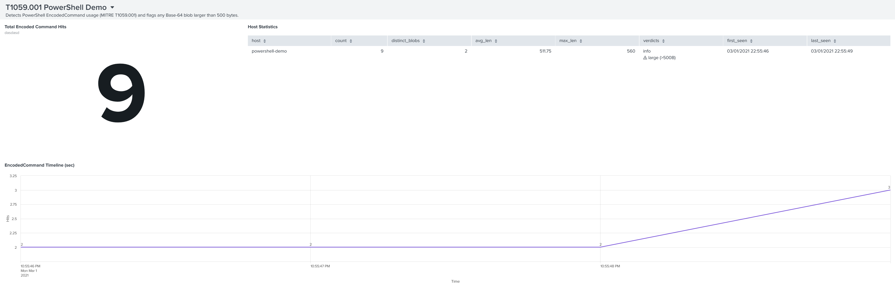

# T1059.001 • PowerShell EncodedCommand Detection (Splunk Dashboard)
> Splunk dashboard that detects PowerShell EncodedCommand usage (MITRE ATT&CK T1059.001) by flagging Base64 blobs over 500 bytes.


| Dashboard  | Saved Search        | Splunk version |
|------------|---------------------|----------------|
| `T1059_001_PowerShell_Demo.dashboard.json` | `T1059 EncodedCommand Advanced` | Cloud / 9.x |

<p align="center">
  
</p>
<p align="center"><em>T1059.001 dashboard showing total hits, host statistics, and timeline</em></p>

## What you get
* **Single-value**: total EncodedCommand events (click to open raw search)
* **Host stats table**: count, distinct blobs, blob size metrics, first/last seen
* **Timeline**: 1-second resolution hit count

All panels honour the global time-range picker.

## Quick-start

```bash
# drop into a Splunk box
$SPLUNK_HOME/etc/apps/
└── T1059_PowerShell_Demo/
````

or install as an app-package:

```bash
splunk install app T1059_PowerShell_Demo.spl
```

## Data assumptions

Events live in `index=main` and contain either
`-EncodedCommand` or `$EncodedCommand = "<base64>"`.

## Credits

* Original log dataset – [MITRE ATT\&CK Datasets project](https://attack.mitre.org/datasources/)
